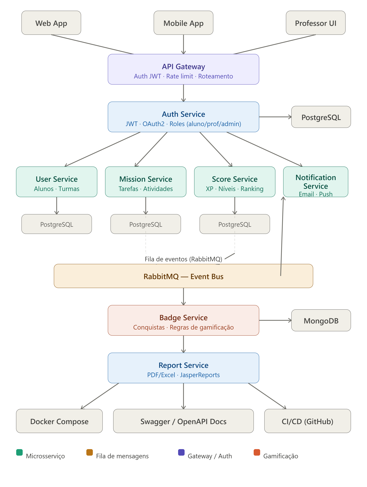

# 🎮 EduG — Gamification System

> Sistema de gamificação acadêmica para disciplinas de graduação, desenvolvido com arquitetura de microsserviços usando Java e Spring Boot.



---

## 📖 Sobre o Projeto

O **EduG** transforma a experiência de uma disciplina em um jogo. Alunos ganham XP ao completar missões, sobem de nível, formam clãs, competem em rankings e conquistam badges — tudo dentro do ambiente acadêmico.

O sistema foi desenvolvido como projeto de TCC e portfólio, aplicando na prática conceitos de arquitetura de microsserviços, mensageria assíncrona, autenticação com JWT e containerização com Docker.

---

## ✨ Funcionalidades

- 🔐 **Autenticação** com JWT e controle de acesso por roles (aluno, professor, admin)
- 🏫 **Turmas** com código de acesso gerado pelo professor
- 📋 **Missões** de 5 tipos: Quiz, Entrega de arquivo, Presença, Cronometrada e Desafio surpresa
- ⚡ **Sistema de XP e Níveis** com 5 níveis: Calouro → Veterano → Especialista → Mestre → Lendário
- ⚔️ **Clãs** formados pelos próprios alunos, com missões coletivas
- 🏆 **Rankings** individual e por clã em tempo real
- 🎖️ **20 Badges** desbloqueáveis por conquistas específicas
- 📊 **Relatórios** em PDF e Excel para o professor
- 🔔 **Notificações** em tempo real para eventos importantes

---

## 🏗️ Arquitetura

O sistema é composto por **6 microsserviços independentes**, comunicando-se via API REST (síncrono) e RabbitMQ (assíncrono).

| Serviço | Responsabilidade | Banco |
|---------|-----------------|-------|
| `auth-service` | Autenticação, JWT, roles | PostgreSQL |
| `user-service` | Alunos, turmas, clãs | PostgreSQL |
| `mission-service` | Missões, entregas, prazos | PostgreSQL |
| `score-service` | XP, níveis, rankings | PostgreSQL |
| `badge-service` | Conquistas, regras de gamificação | MongoDB |
| `notification-service` | Notificações por email e push | — |
| `report-service` | Geração de PDF e Excel | — |

---

## 🛠️ Tecnologias

**Backend**
- Java 21
- Spring Boot 3
- Spring Security + JWT
- Spring Data JPA
- RabbitMQ (mensageria)
- JasperReports (relatórios)

**Banco de Dados**
- PostgreSQL
- MongoDB

**Infraestrutura**
- Docker + Docker Compose
- GitHub Actions (CI/CD)
- Swagger / OpenAPI

---

## 📁 Estrutura do Projeto

```
edug-gamification/
├── docs/
│   ├── gamificacao_arquitetura.png
│   └── requisitos_gamificacao.md
├── services/
│   ├── auth-service/
│   ├── user-service/
│   ├── mission-service/
│   ├── score-service/
│   ├── badge-service/
│   ├── notification-service/
│   └── report-service/
├── docker-compose.yml
└── README.md
```

---

## 🚀 Como rodar localmente

### Pré-requisitos

- Java 21+
- Docker e Docker Compose
- Maven 3.8+

### 1. Clone o repositório

```bash
git clone https://github.com/JonathanPonte/edug-gamification.git
cd edug-gamification
```

### 2. Suba a infraestrutura com Docker

```bash
docker-compose up -d
```

Isso irá subir:
- PostgreSQL na porta `5433`
- MongoDB na porta `27017`
- RabbitMQ na porta `5672` (painel em `15672`)
- pgAdmin na porta `5050`

### 3. Rode o Auth Service

```bash
cd services/auth-service
mvn spring-boot:run
```

> Os demais serviços seguem o mesmo padrão. Documentação de cada um está na pasta do serviço.

### 4. Acesse a documentação

Com o serviço rodando, acesse o Swagger em:
```
http://localhost:8080/swagger-ui.html
```

---

## 📚 Documentação

- [Documento de Requisitos](docs/requisitos_gamificacao.md)
- [Diagrama de Arquitetura](docs/gamificacao_arquitetura.png)

---

## 🗺️ Roadmap

- [x] Documento de requisitos
- [x] Arquitetura do sistema
- [x] Auth Service — registro e login com JWT ✅
- [ ] Auth Service — refresh token, /validate, Swagger, testes
- [ ] User Service
- [ ] Mission Service
- [ ] Score Service
- [ ] Badge Service
- [ ] Notification Service
- [ ] Report Service
- [ ] Docker Compose completo
- [ ] CI/CD com GitHub Actions
- [ ] Testes de integração

---

## 👨‍💻 Autor

**Jonathan Ponte**
- LinkedIn: [linkedin.com/in/jonathan-ponte-dev](https://linkedin.com/in/jonathan-ponte-dev)
- GitHub: [github.com/JonathanPonte](https://github.com/JonathanPonte)
- Email: jonadponte@gmail.com
